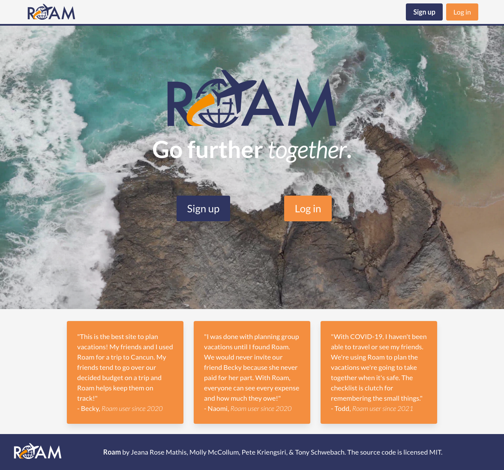
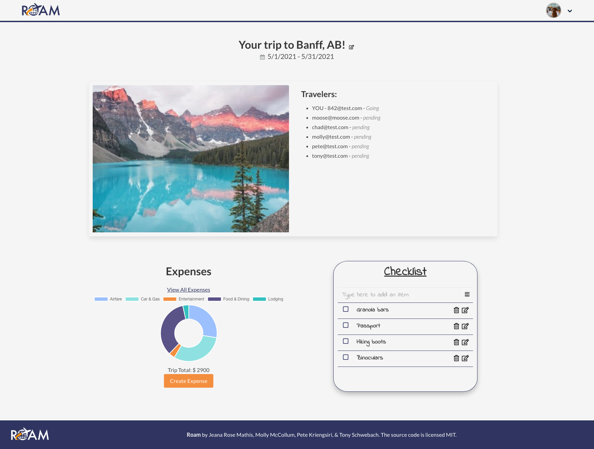
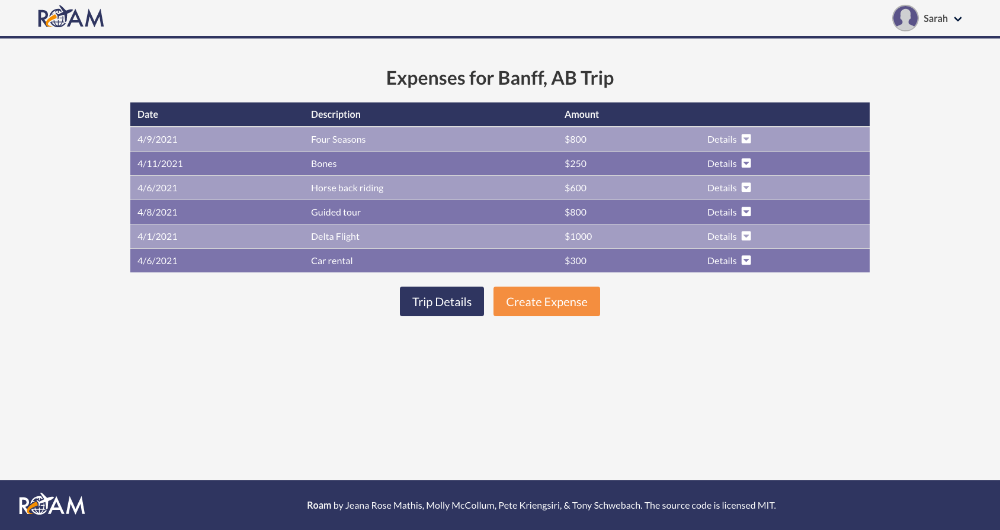
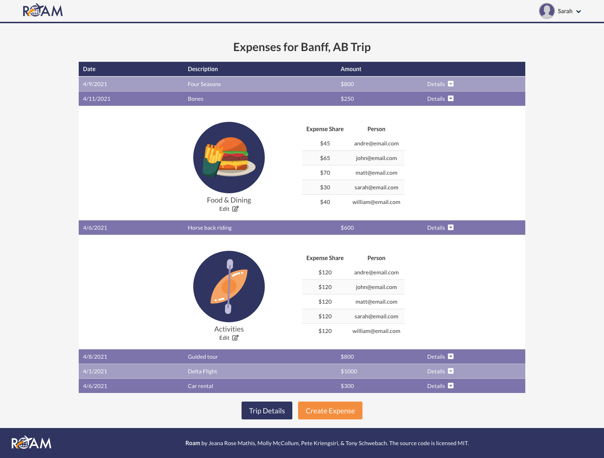

# Roam 

    

## Description

[Roam](https://www.roam-together.com/) is a group vacation planning application built using the MERN stack. The application allows users to create a trip and invite their travel companions to plan the trip with them. With Roam you can easily track expenses and split costs among group members. Roam also features a group checklist to streamline the trip planning process. 

## Table of Contents

* [Installation](#Installation)
* [Usage](#Usage)
* [Technologies](#Technologies)
* [Contributions](#Contributions)
* [Credits](#Credits)
* [License](#License)

## Usage

On the Dashboard, the user can create a trip as well as view all, upcoming, or past trips. 

From the dashboard, the user can navigate to view a single trip. There you can find information about travel companions, expenses and a shared checklist for the trip. 

When viewing all expenses, the user is presented with an organized table of expenses information including the date created, a description of the expense, and the amount. 

When details is clicked on the expense table, the user is presented with a dropdown showing more information about the expense including the category and how much each travel companion paid. 

## Installation
1. Copy the SSH key in the green "Code" button.
2. Use the command `git clone [insert SSH key URL]` and click **Enter** (_Requires Git_).
3. Run `npm install` to install the dependencies. 

## Technologies 
- React
- Express
- Node.js
- MongoDB
- mongoose 
- Bulma
- Node Sass
- moment.js
- bcrypt
- json web token
- express jwt
- dotenv
- axios
- Cookies-parser
- React-dates 
- react-router-dom
- Chart.js
- Google Places API 
- Cloudinary - Express File Upload
- Figma
- Canva

## Contributions
Roam was created by:
[Jeana Rose Mathis](https://github.com/jeanarose),
[Molly McCollum](https://github.com/mollymccollumwx),
[Pete Kriengsiri](https://github.com/pkriengsiri), &
[Tony Schwebach](https://github.com/tonyschwebach).

This repo is not taking any additional contributors right now. 

## Credits:

The following resources were helpful in the success of this application:

- [Icon in the brand logo](https://svg2jsx.com/)
- [Beach video on the landing page](https://www.pexels.com/@michalmarek?utm_content=attributionCopyText&utm_medium=referral&utm_source=pexels)
- [CSS animations](https://www.w3schools.com/css/css3_animations.asp)
- [Convert SVG to jsx](https://svg2jsx.com/)
- [Setting up protected client side routes with cookies and isLoading](https://levelup.gitconnected.com/react-template-for-jwt-authentication-with-private-routes-and-redirects-f77c488bfb85)

## License
MIT License

Copyright (c) [2021] [Jeana Rose Mathis, Molly McCollum, Pete Kriengsiri, & Tony Schwebach]

Permission is hereby granted, free of charge, to any person obtaining a copy of this software and associated documentation files (the "Software"), to deal in the Software without restriction, including without limitation the rights to use, copy, modify, merge, publish, distribute, sublicense, and/or sell copies of the Software, and to permit persons to whom the Software is furnished to do so, subject to the following conditions:

The above copyright notice and this permission notice shall be included in all copies or substantial portions of the Software.

THE SOFTWARE IS PROVIDED "AS IS", WITHOUT WARRANTY OF ANY KIND, EXPRESS OR IMPLIED, INCLUDING BUT NOT LIMITED TO THE WARRANTIES OF MERCHANTABILITY, FITNESS FOR A PARTICULAR PURPOSE AND NONINFRINGEMENT. IN NO EVENT SHALL THE AUTHORS OR COPYRIGHT HOLDERS BE LIABLE FOR ANY CLAIM, DAMAGES OR OTHER LIABILITY, WHETHER IN AN ACTION OF CONTRACT, TORT OR OTHERWISE, ARISING FROM, OUT OF OR IN CONNECTION WITH THE SOFTWARE OR THE USE OR OTHER DEALINGS IN THE SOFTWARE.

